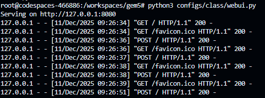
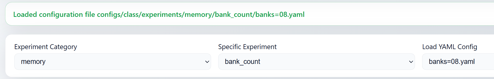
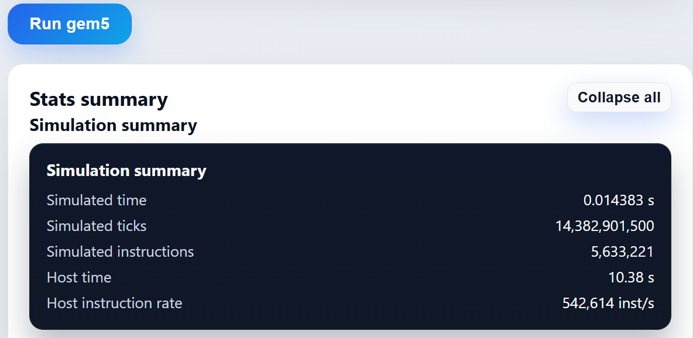

# gem5 class workflow quickstart

This repo snapshot includes a lightweight web UI and helper scripts for the **configs/class** teaching workloads. This page shows how to launch the UI, add experiments, and run YAML configs from the CLI.

## 1) Web UI (configs/class/webui.py)
- Start: `python3 configs/class/webui.py` (add `--debug` to also show stdout/stderr).  
  
- In the browser: choose *Experiment Category* → *Specific Experiment* → *Load YAML Config*, or fill fields manually.  
  
- Click **Run gem5** to launch the run and view the stats summary when it finishes.  
  
## 2) Add your own experiments
- Add YAMLs to `configs/class/experiments/<category>/<experiment>/`; they will appear in the UI dropdown.
- Typical keys mirror the UI fields (CPU, memory, cache, workload). Example: `configs/class/experiments/memory/bank_count/bank8.yaml`.

## 3) Add custom workloads
- Add a C program in `tests/class/src/`, include the name in `PROGS` in `tests/class/src/Makefile`, then run `make -C tests/class/src`.
- Binaries land in `tests/class/bin/x86/` and are available in the UI or via YAML `cmd`.

## 4) Run a YAML from the CLI (no web UI)
- `python3 configs/class/run_yaml.py <yaml>` — run a config using `configs/class/run.sh`.
- Options: `--override-cmd <workload>`, `--run-script <path>`, `--skip-parse`, `--verbose`.
- example: `python3 configs/class/run_yaml.py configs/class/experiments/memory/bank_count/banks=08.yaml`

## 5) Run all experiments in bulk
- `python3 configs/class/run_all_experiments.py` will iterate every YAML under `configs/class/experiments/`,  then summarize stats and write outputs to `configs/class/result/<experiment>/<config>.stats`.
- Flags (see `--help` for full list):
  - `--experiments-dir <dir>`: where to find YAMLs (default `configs/class/experiments/`).
  - `--result-dir <dir>`: where summaries go (default `configs/class/result/`).
  - `--override-cmd <workload>`: replace YAML `cmd`.
  - `--skip-existing`: skip configs that already have a summary file.
  - `--copy-stats`: also copy raw `m5out/stats.txt` into the result folder (`.stats.txt`).
  - `--verbose`: print the invoked commands and parse steps.
- Example: `python3 configs/class/run_all_experiments.py --experiments-dir configs/class/experiments/memory --result-dir configs/class/result/memory --copy-stats`

# Memory experiments (what to run & observe)
1) Included memory experiments (`configs/class/experiments/memory/`):
   - `bank_count`: banks=08/16/32
   - `bank_group`: bg=0/2/4
   - `bus_width`: bus=x4/x8/x16
   - `channels`: chan=1/2/4/8
   - `interleave`: intlv=064/128/256/512
   - `mem_size`: size=0512MiB/2048MiB/4096MiB
   - `mem_type`: type=ddr3/ddr4/hbm/simplemem
   - `organization`: org=1rank_x8 / 2rank_x4 / 4rank_x4
   - `page_policy`: open / open_adaptive / close / close_adaptive
   - `powerdown`: pd=true / pd=false
   - `timing`: baseline / fast / slow
2) Workload: examples like `tests/class/bin/x86/class_stream_saturate` are bandwidth-heavy streaming kernels (sequential loads/stores) that stress DRAM throughput and queueing behavior.
3) Useful stats to watch (e.g., `result/memory/powerdown`):

   | Metric (avg/representative)                | Powerdown off (`pd=false`) | Powerdown on (`pd=true`) | Note |
   | ---                                        | ---                        | ---                      | --- |
   | Simulated time                             | 0.0145 s                   | 0.0155 s                 | ~+7% longer |
   | CPU IPC                                    | ~0.097                     | ~0.091                   | Lower IPC with powerdown |
   | L2 miss rate                               | 99.83%                     | ~100%                    | Almost identical (streaming) |
   | Avg mem access latency (ns)                | ~30.4                      | ~35–41                   | +15–35% higher latency |
   | Total DRAM bandwidth per ctrl (B/s)        | ~1.27e9                    | ~1.19e9                  | ~6% drop |
   | Read/write queue len (avg)                 | R~1.99 / W~54.6            | R~2.13 / W~54.2          | Slightly higher read queue |
   | RD->WR / WR->RD turnarounds                | ~7.75k                     | ~7.78k                   | Small increase |

   When powerdown is enabled, memory spends more time waking/reactivating, which raises latency and lowers effective bandwidth/IPC; queue lengths tick up slightly, while access mix and miss behavior stay similar for this streaming workload.
